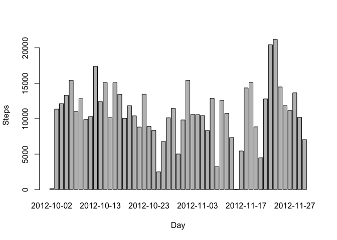
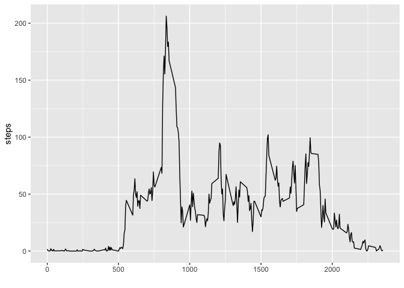
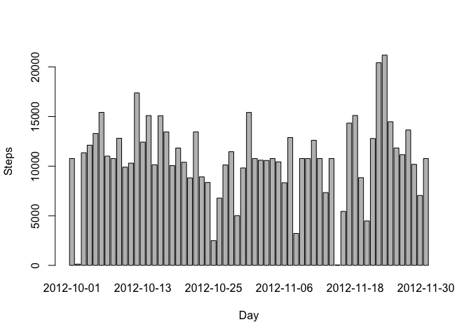
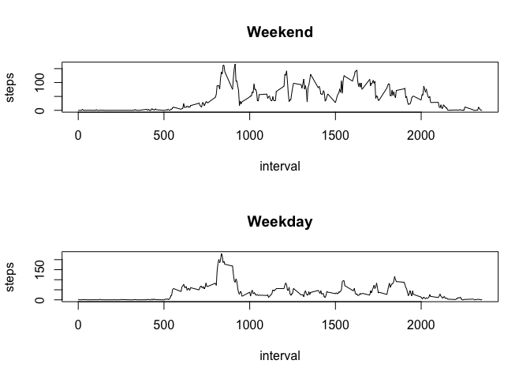

## Loading and preprocessing the data

```r
temp <- tempfile()
download.file("https://d396qusza40orc.cloudfront.net/repdata%2Fdata%2Factivity.zip",temp)
activity <- read.csv(unz(temp, "activity.csv"), na.strings = "NA", sep = ",", header = TRUE)
unlink(temp)
```


## What is mean total number of steps taken per day?

```r
# Number of steps taken per day
dailyData <- aggregate(steps ~ date, data=activity, FUN=sum)
# Histogram Plot
barplot(dailyData$steps, names.arg=dailyData$date, xlab="Day", ylab="Steps")
```

<!-- -->

```r
# Mean of daily steps
mean(dailyData$steps)
```

```
## [1] 10766.19
```

```r
# Median of daily steps
median(dailyData$steps)
```

```
## [1] 10765
```


## What is the average daily activity pattern?

```r
library(ggplot2)
timeIntervalData <- aggregate(steps ~ interval, data=activity, FUN=mean)
ggplot(timeIntervalData, aes(x=interval, y=steps)) + geom_line() + xlab("")
```

<!-- -->

```r
max <- subset(timeIntervalData, timeIntervalData$steps >= max(timeIntervalData$steps))
# Interval that contains the max number of steps
max$interval
```

```
## [1] 835
```


## Imputing missing values

```r
colSums(is.na(activity))
```

```
##    steps     date interval 
##     2304        0        0
```

```r
nas <- is.na(activity$steps)
activity <- merge(activity, timeIntervalData, by="interval", suffixes=c("",".mean"))
for (i in 1:dim(activity)[1]) {
  if(is.na(activity$steps[i])){
    activity$steps[i] <- activity$steps.mean[i]
  }
}
activity <- activity[,c(1:3)]
colSums(is.na(activity))
```

```
## interval    steps     date 
##        0        0        0
```

```r
dailyData2 <- aggregate(steps ~ date, data=activity, FUN=sum)
# Histogram Plot
barplot(dailyData2$steps, names.arg=dailyData2$date, xlab="Day", ylab="Steps")
```

<!-- -->

```r
# Mean of daily steps
mean(dailyData2$steps)
```

```
## [1] 10766.19
```

```r
# Median of daily steps
median(dailyData2$steps)
```

```
## [1] 10766.19
```

```r
# Difference in means
abs(mean(dailyData$steps) - mean(dailyData2$steps))
```

```
## [1] 0
```

```r
# Difference in medians
abs(median(dailyData$steps) - median(dailyData2$steps))
```

```
## [1] 1.188679
```


## Are there differences in activity patterns between weekdays and weekends?

```r
isWeekend <- function(date) {
  if (weekdays(as.Date(date)) %in% c("Saturday", "Sunday")) {
    TRUE
  } else {
    FALSE
  }
}
activity$isWeekend <- as.factor(sapply(activity$date, isWeekend))
par(mfrow=c(2,1))
for (type in c(TRUE, FALSE)) {
  steps.type <- aggregate(steps ~ interval,
                          data=activity,
                          subset=activity$isWeekend==type,
                          FUN=mean)
  label <- "Weekday"
  if(type == T){label <- "Weekend"}
  plot(steps.type, type="l", main=label)
}
```

<!-- -->
